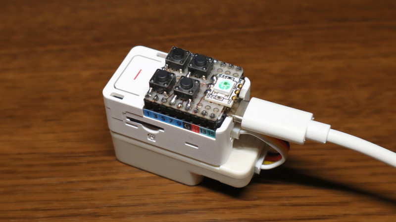

# SMF (Standard MIDI File) Player for M5Capsule

This is heavily based on the work of @catsin san.  
https://bitbucket.org/kyoto-densouan/smfseq/src/m5stack/

## Hardware Requirements
- M5Capsule
- Unit Synth
- tack switchs x 4
- NeoPixel LED x 1

## Development Environment
- PlatformIO

## Usage
Plays SMF files "playdat0.mid" - "playdat9.mid" in the SD card.

### Buttons
- M5Capsule button : Play / Pause (single click), Rewind (double click)
- \< button : Previous 
- \> button : Next
- \+ button : Volume Up
- \- button : Volume Down

### Status LED
- Yellow : Initializing
- Cyan : Loading or Stopping
- Green : Stopped
- Blue : Playing
- Red : Error

## Pin assignments

|Function|Pin No.|
|---|---|
|MIDI RX|15 (Grove connector)|
|MIDI TX|13 (Grove connector)|
|M5Capsule button|42|
|\< Button|1|
|\> Button|3|
|+ Button|5|
|- Button|7|
|NeoPixel LED|9 (NOT on M5Capsule)|

## Note
Modify 5V pin of Grove connector.  
Connect it to 5Vin instead of 5Vout. (remove resistor R1 and short R0)  
Requires the external power (USB or 5Vin).
